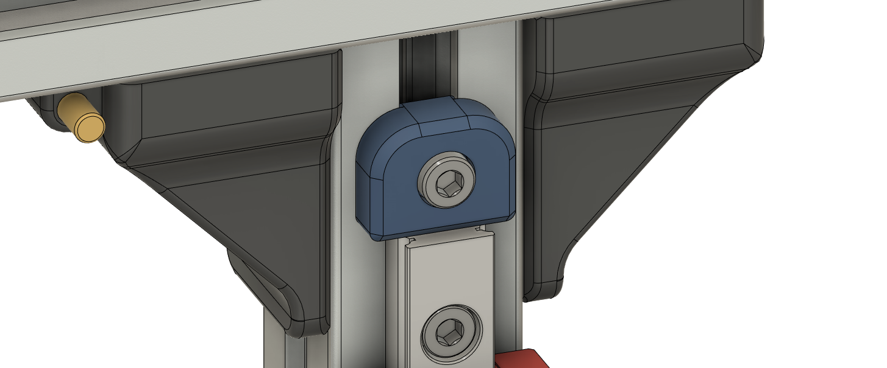

# Trident_Chamber_Thermistor
 Z axis brace with slot for chamber thermistor

Modified version of the stock Trident Z axis brace. Can hold a generic 3mm NTC 100k cartridge style thermistor.

## Credits
- Created using Trident CAD from the <a href="https://github.com/VoronDesign/Voron-Trident"> VoronDesign repo.</a>